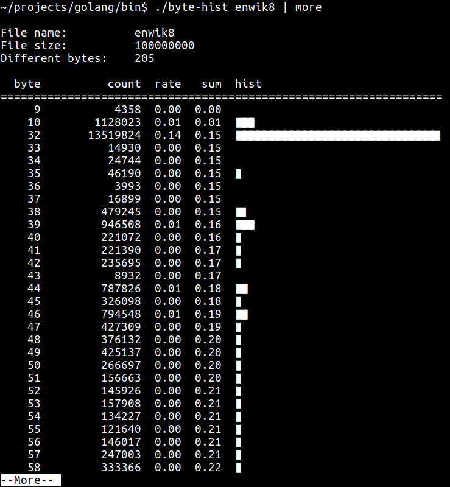

# byte-hist

[](https://travis-ci.org/vteromero/byte-hist)
[](https://goreportcard.com/report/github.com/vteromero/byte-hist)



`byte-hist` is a simple tool that prints a histogram of the bytes of a file.

## Installation

To install byte-hist, simply run:

```
$ go get -v github.com/vteromero/byte-hist
```

Once the `get` completes, you should find the `byte-hist` executable inside
`$GOPATH/bin`.

## Usage

These are some examples of how you can run `byte-hist`:

```
$ ./byte-hist file                      # print the byte histogram of file
$ ./byte-hist -format=x file            # the bytes are printed in hexadecimal format
$ echo "hello world!" | ./byte-hist     # you can use a pipe
```

For the complete list of available options, just type:

```
$ ./byte-hist -help
```

